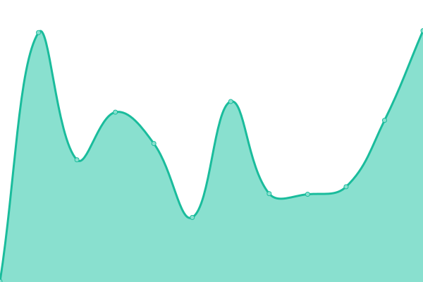

# [📈 Live Status](https://status.tryton.org): <!--live status--> **🟧 Partial outage**

This repository contains the open-source uptime monitor and status page for [Tryton](https://www.tryton.org/), powered by [Upptime](https://github.com/upptime/upptime).

With [Upptime](https://upptime.js.org), you can get your own unlimited and free uptime monitor and status page, powered entirely by a GitHub repository. We use [Issues](https://github.com/tryton/upptime/issues) as incident reports, [Actions](https://github.com/tryton/upptime/actions) as uptime monitors, and [Pages](https://status.tryton.org) for the status page.

<!--start: status pages-->
<!-- This summary is generated by Upptime (https://github.com/upptime/upptime) -->
<!-- Do not edit this manually, your changes will be overwritten -->
<!-- prettier-ignore -->
| URL | Status | History | Response Time | Uptime |
| --- | ------ | ------- | ------------- | ------ |
|  [Tryton](https://www.tryton.org) | 🟩 Up | [tryton.yml](https://github.com/tryton/upptime/commits/HEAD/history/tryton.yml) | 

 1292ms
     
 | 

<a href="https://status.tryton.org/history/tryton">100.00%</a>
    

|  [Discuss](https://discuss.tryton.org/srv/status) | 🟩 Up | [discuss.yml](https://github.com/tryton/upptime/commits/HEAD/history/discuss.yml) | 

 619ms
     
 | 

<a href="https://status.tryton.org/history/discuss">100.00%</a>
    

|  [Demo](https://demo.tryton.org) | 🟩 Up | [demo.yml](https://github.com/tryton/upptime/commits/HEAD/history/demo.yml) | 

 1479ms
     
 | 

<a href="https://status.tryton.org/history/demo">100.00%</a>
    

|  [Demo 7.8](https://demo7.8.tryton.org) | 🟩 Up | [demo-7-8.yml](https://github.com/tryton/upptime/commits/HEAD/history/demo-7-8.yml) | 

 222ms
     
 | 

<a href="https://status.tryton.org/history/demo-7-8">100.00%</a>
    

|  [Demo 7.6](https://demo7.6.tryton.org) | 🟩 Up | [demo-7-6.yml](https://github.com/tryton/upptime/commits/HEAD/history/demo-7-6.yml) | 

 640ms
     
 | 

<a href="https://status.tryton.org/history/demo-7-6">100.00%</a>
    

|  [Demo 7.4](https://demo7.4.tryton.org) | 🟩 Up | [demo-7-4.yml](https://github.com/tryton/upptime/commits/HEAD/history/demo-7-4.yml) | 

 714ms
     
 | 

<a href="https://status.tryton.org/history/demo-7-4">100.00%</a>
    

|  [Demo 7.0](https://demo7.0.tryton.org) | 🟩 Up | [demo-7-0.yml](https://github.com/tryton/upptime/commits/HEAD/history/demo-7-0.yml) | 

 693ms
     
 | 

<a href="https://status.tryton.org/history/demo-7-0">100.00%</a>
    

|  [Demo 6.0](https://demo6.0.tryton.org) | 🟩 Up | [demo-6-0.yml](https://github.com/tryton/upptime/commits/HEAD/history/demo-6-0.yml) | 

 732ms
     
 | 

<a href="https://status.tryton.org/history/demo-6-0">99.38%</a>
    

|  [Weblate](https://translate.tryton.org) | 🟥 Down | [weblate.yml](https://github.com/tryton/upptime/commits/HEAD/history/weblate.yml) | 

 700ms
     
 | 

<a href="https://status.tryton.org/history/weblate">62.41%</a>
    

|  [Documentation](https://docs-src.tryton.org) | 🟩 Up | [documentation.yml](https://github.com/tryton/upptime/commits/HEAD/history/documentation.yml) | 

 829ms
     
 | 

<a href="https://status.tryton.org/history/documentation">100.00%</a>
    

|  [DNS 1](moretus.b2ck.com) | 🟩 Up | [dns-1.yml](https://github.com/tryton/upptime/commits/HEAD/history/dns-1.yml) | 

 105ms
     
 | 

<a href="https://status.tryton.org/history/dns-1">100.00%</a>
    

|  [DNS 2](thales.b2ck.com) | 🟩 Up | [dns-2.yml](https://github.com/tryton/upptime/commits/HEAD/history/dns-2.yml) | 

 106ms
     
 | 

<a href="https://status.tryton.org/history/dns-2">99.82%</a>
    

|  [SMTP](mx.tryton.org) | 🟩 Up | [smtp.yml](https://github.com/tryton/upptime/commits/HEAD/history/smtp.yml) | 

 106ms
     
 | 

<a href="https://status.tryton.org/history/smtp">100.00%</a>
    

|  [POP](pop.tryton.org) | 🟩 Up | [pop.yml](https://github.com/tryton/upptime/commits/HEAD/history/pop.yml) | 

 104ms
     
 | 

<a href="https://status.tryton.org/history/pop">100.00%</a>
    

|  [Foundation's Tryton](https://foundation.tryton.org:9000/) | 🟩 Up | [foundation-s-tryton.yml](https://github.com/tryton/upptime/commits/HEAD/history/foundation-s-tryton.yml) | 

 1365ms
     
 | 

<a href="https://status.tryton.org/history/foundation-s-tryton">100.00%</a>
    

<!--end: status pages-->

[**Visit our status website →**](https://status.tryton.org)

## 📄 License

- Powered by: [Upptime](https://github.com/upptime/upptime)
- Code: [MIT](./LICENSE) © [Anand Chowdhary](https://anandchowdhary.com), supported by [Pabio](https://pabio.com)
- Data in the `./history` directory: [Open Database License](https://opendatacommons.org/licenses/odbl/1-0/)
